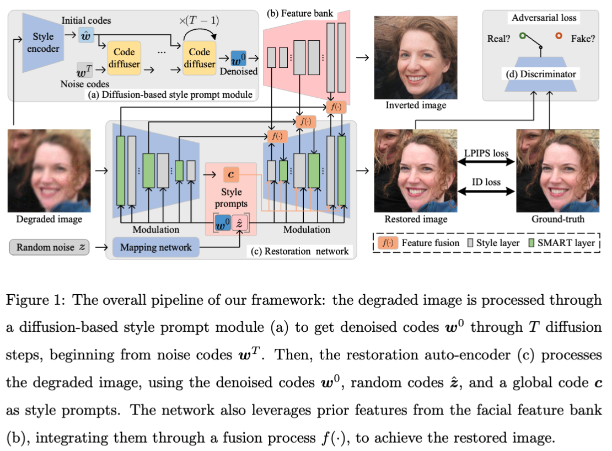
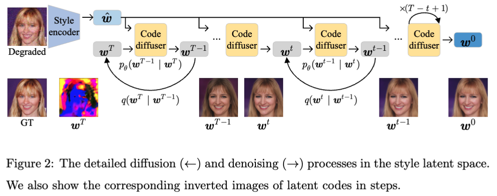
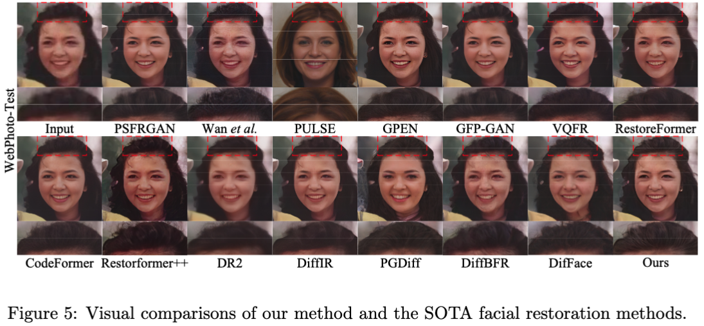
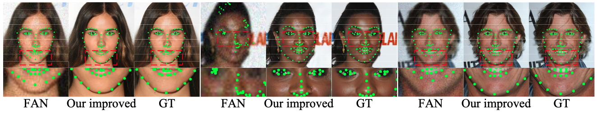
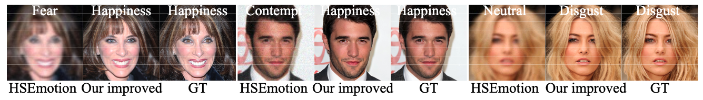

# Visual Style Prompt Learning Using Diffusion Models for Blind Face Restoration (VSPBFR)

Official PyTorch implementation of VSPBFR.

Pattern Recognition 🔥🔥🔥 [[paper]](https://www.sciencedirect.com/science/article/pii/S003132032401063X?via%3Dihub)  
[HuggingFace model card](https://huggingface.co/Wanglong2/VSPBFR)
[](https://badges.toozhao.com/stats/01JG80JMZ79FN7DVMF0D6RG1BF "Get your own page views count badge on badges.toozhao.com")


<div style="text-align: justify"> Blind face restoration aims to recover high-quality facial images from various unidentified sources of degradation, posing significant challenges due to the minimal information retrievable from the degraded images. 
Prior knowledge-based methods, leveraging geometric priors and facial features, have led to advancements in face restoration but often fall short of capturing fine details. To address this, we introduce a visual style prompt learning framework that utilizes diffusion probabilistic models to explicitly generate visual prompts within the latent space of pre-trained generative models. These prompts are designed to guide the restoration process.
To fully utilize the visual prompts and enhance the extraction of informative and rich patterns, we introduce a style-modulated aggregation transformation layer. Extensive experiments and applications demonstrate the superiority of our method in achieving high-quality blind face restoration.</div>





## Getting Started
#### Requirements
Corresponding packages are in the requirements.txt file.
- Note that other versions of PyTorch (e.g., higher than 1.7) also work well, but you have to install the corresponding CUDA version. 
- Tip: please make sure that CUDA, CUDNN, and PyTorch are aligned well with each other; see here [PyTorch](https://pytorch.org/get-started/previous-versions/).
#### Installation
```python
git clone 
cd StylePromptRestoration
conda create -n VSPBFR
conda activate VSPBFR
pip install -r requirements.txt
```

##### What we have released
- [x] Training and testing codes
- [x] Pre-trained models


## Dataset
- Training data: our model was trained with FFHQ, which was attained from the [FFHQ](https://github.com/NVlabs/ffhq-dataset) repository. The original size of the images in FFHQ are 1024x1024. We resize them to 512x512 with bilinear interpolation in our work.
- Test data: CelebA-Test, LFW-Test, WebPhoto-Test, and CelebChild-Test; please check the repo from  [RestoreFormer++](https://github.com/wzhouxiff/RestoreFormerPlusPlus)


## Training
- Utilize all images for training. The folder structure of training and testing data is shown below:  
```
root/
    train/
        xxx.png
        ...
        xxz.png
```

- Prepare pre-trained checkpoints:
[Arcface.pth](https://huggingface.co/Wanglong2/VSPBFR/blob/main/Arcface.pth), 
[style_encoder_decoder.pt](https://huggingface.co/Wanglong2/VSPBFR/blob/main/style_encoder_decoder.pt) (put models in ./pre-train),
[code_diffuser.pt](https://huggingface.co/Wanglong2/VSPBFR/blob/main/code_diffuser.pt) (put models in ./pre-train),
[restoration_net.pt](https://huggingface.co/Wanglong2/VSPBFR/blob/main/restoration_net.pt) (put models in ./pre-train)


#### Training the style encoder
- We utilize e4e to train our style encoder, for more details, please refer to [e4e_trainer](https://github.com/LonglongaaaGo/e4e_trainer?tab=readme-ov-file#training-the-e4e-encoder-for-the-visual-style-prompt-restoration).
- We have prepared the pre-trained checkpoints for you: [style_encoder_decoder.pt](https://huggingface.co/Wanglong2/VSPBFR/blob/main/style_encoder_decoder.pt) (put models in ./pre-train)

#### Training the code diffuser
```python
python code_diffuser_train.py
--path [training img folder]
--psp_checkpoint_path [style encoder checkpoint]
--arcface_path [Arcface checkpoint]
```

#### Training the restoration network
```python restoration_train.py 
--path [training img folder]
--batch 4
--psp_checkpoint_path [style encoder checkpoint]
--arcface_path [Arcface checkpoint]
--ddpm_ckpt [code diffuser checkpoint]
--size 512
--percept_loss_weight 0.5
--iter 500000
```


## Inference
- Prepare pre-trained checkpoints:
[Arcface.pth](https://huggingface.co/Wanglong2/VSPBFR/blob/main/Arcface.pth), 
[style_encoder_decoder.pt](https://huggingface.co/Wanglong2/VSPBFR/blob/main/style_encoder_decoder.pt) (put models in ./pre-train),
[code_diffuser.pt](https://huggingface.co/Wanglong2/VSPBFR/blob/main/code_diffuser.pt) (put models in ./pre-train),
[restoration_net.pt](https://huggingface.co/Wanglong2/VSPBFR/blob/main/restoration_net.pt) (put models in ./pre-train)


#### Testing the restoration network
```python restoration_test.py
--ckpt_root [restoration network checkpoint]
--lq_data_list [low-quality image data path list. For example:  ./patha,./pathb,...]
--hq_data_list [high-quality image data path list. For example:  ./patha,None,... ] (if there is no ground truth images, just put None)
--data_name_list [dataname list. For example:  dataset_name_a, dataset_name_b,...]
--psp_checkpoint_path [style encoder checkpoint]
--arcface_path [Arcface checkpoint]
--ddpm_ckpt [code diffuser checkpoint]
--size 512
--batch 4
```

## Bibtex
- If you find our code useful, please cite our paper:
  ```
  @article{LU2024111312,
  title = {Visual style prompt learning using diffusion models for blind face restoration},
  journal = {Pattern Recognition},
  pages = {111312},
  year = {2024},
  issn = {0031-3203},
  doi = {https://doi.org/10.1016/j.patcog.2024.111312},
  url = {https://www.sciencedirect.com/science/article/pii/S003132032401063X},
  author = {Wanglong Lu and Jikai Wang and Tao Wang and Kaihao Zhang and Xianta Jiang and Hanli Zhao},
  keywords = {Denoising diffusion probabilistic models, Generative adversarial networks, Blind face restoration},
  abstract = {Blind face restoration aims to recover high-quality facial images from various unidentified sources of degradation, posing significant challenges due to the minimal information retrievable from the degraded images. Prior knowledge-based methods, leveraging geometric priors and facial features, have led to advancements in face restoration but often fall short of capturing fine details. To address this, we introduce a visual style prompt learning framework that utilizes diffusion probabilistic models to explicitly generate visual prompts within the latent space of pre-trained generative models. These prompts are designed to guide the restoration process. To fully utilize the visual prompts and enhance the extraction of informative and rich patterns, we introduce a style-modulated aggregation transformation layer. Extensive experiments and applications demonstrate the superiority of our method in achieving high-quality blind face restoration.}
  }
  ```


## Results



Incorporating our restoration method significantly improves facial landmark detection and ace emotion recognition by enhancing the clarity of facial features in the restored images.


## Acknowledgements

- **EXE-GAN**: [EXE-GAN](https://github.com/LonglongaaaGo/EXE-GAN)
- **PromptRR**: [PromptRR](https://github.com/TaoWangzj/PromptRR)
- **DiffIR**: [DiffIR](https://github.com/Zj-BinXia/DiffIR)
- **RestoreFormer++**:  [RestoreFormer++](https://github.com/wzhouxiff/RestoreFormerPlusPlus)
- **pSp encoder**: [pSp](https://github.com/eladrich/pixel2style2pixel)
